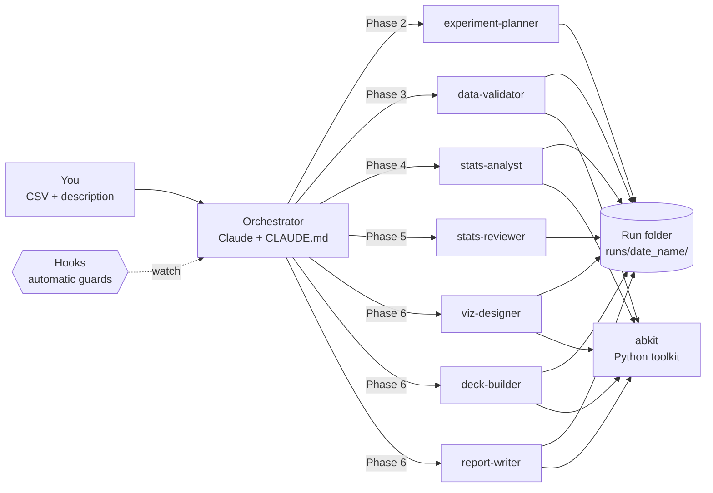

# How the automated A/B testing pipeline analysed the marketing ads experiment

*A walkthrough for anyone: business readers, analysts and data scientists.*
Run folder: `runs/2026-10-01_marketing-ads/` · Data: `data/marketing_AB.csv` · Description: `data/Marketing-AB-Testing.md`

---

## 1. The short version

A marketing team showed ads to most users and a public service announcement (PSA) to a small control group. They
wanted to know two things: **did the ads work, and how much of the success was caused by the ads?**

We gave the pipeline the CSV and the description. It then:

1. asked 8 clarifying questions,
2. proposed a plan and waited for approval,
3. **stopped** when the data didn't match the stated 95/5 split, and asked what to do (the real split was 96/4),
4. ran the statistics,
5. had an independent reviewer check everything (two rounds),
6. produced a deck, a stakeholder report, a technical report and six charts.

**Result: Ship.** Users who saw ads converted at **2.55%** vs **1.79%** with the PSA, a **+43.1% lift**
(95% CI +29.3% to +56.8%, p < 0.001). That is about **7.7 extra conversions per 1,000 users**, roughly **4,343
extra conversions**, or **~30%** of all conversions in the ad group. The main caveat: confirm with the data owner that
users were randomly assigned (the PSA user IDs form one separate block).

---

## 2. The big picture: what the pipeline is made of



| Part | What it is | Where it lives | Analogy |
|---|---|---|---|
| **Orchestrator** | The main Claude session. Talks to you, runs the phases in order, holds the approvals | `CLAUDE.md` (its rulebook) | Project manager |
| **7 agents** | Specialists, each with one job and limited tools | `.claude/agents/*.md` | The team |
| **Skills** | Reference knowledge the agents read: methods, chart style, deck style, report style | `.claude/skills/` | The playbooks |
| **abkit** | The tested Python toolkit: statistics, checks, charts, deck and report builders | `abkit/` | The machinery |
| **Hooks** | Small scripts that run automatically and block mistakes | `.claude/hooks/` + `.claude/settings.json` | Safety interlocks |
| **Run folder** | Everything about one experiment: inputs, decisions, code, numbers, outputs | `runs/2026-10-01_marketing-ads/` | The case file |

Two ideas hold it together:

- **One source of truth.** Every number lives in `results.json`. Charts, deck and reports only *read* it; nobody
  types a number by hand.
- **Gates.** Analysis can't start before you approve the plan and the data passes validation. The deck and
  reports can't be built before the reviewer signs off.

---

## 3. The seven phases (same for every experiment)

| # | Phase | Who | What happens | Gate |
|---|---|---|---|---|
| 1 | Intake | Orchestrator | Creates the run folder, asks only the unanswered questions, shows statistical defaults | - |
| 2 | Planning | experiment-planner | Picks methods, charts and deck sections; writes `plan.md` | **You approve** -> `plan_approved` |
| 3 | Validation | data-validator | Checks the data (duplicates, split, outliers...); stops on a blocking problem | `validation_passed` |
| 4 | Analysis | stats-analyst | Runs each planned step as a numbered script; writes `results.json` | - |
| 5 | Review | stats-reviewer | Independent check from the files alone; fixes loop back (max 2), blockers go to you | `review_passed` |
| 6 | Deliverables | viz-designer, deck-builder, report-writer | Charts -> deck -> summary report + technical report | - |
| 7 | Wrap-up | Orchestrator | Checks every deliverable exists, every number traces to `results.json`, sends you a summary | - |

---

## 4. The marketing run, step by step

### Step 0: Inputs
- `data/marketing_AB.csv`: **588,101 users**, one row each. Columns: `user id`, `test group` (`ad` / `psa`),
  `converted` (True/False), `total ads`, `most ads day`, `most ads hour`.
- `data/Marketing-AB-Testing.md`: the description and the two business questions.

### Step 1: Intake (orchestrator)
The pipeline created the run folder, copied the CSV into `data/` (the original is never touched), saved the
description as `context.md`, and looked at the data. It saw 564,577 ad users (96.0%) and 23,524 PSA users (4.0%),
with no duplicates and no missing values.

It asked only what the description didn't answer:

| # | Question | Your answer |
|---|---|---|
| 1 | Intended ad/PSA split? | 95/5 *(later corrected to 96/4)* |
| 2 | Value per conversion? | No, so money impact is shown as a formula |
| 3 | Smallest lift worth acting on? | 5% relative |
| 4 | Was the test stopped early or peeked at? | No |
| 5 | Break down by ads seen / day / hour? | Yes, labelled exploratory |
| 6 | Bayesian view too? | Both frequentist and Bayesian |
| 7 | Keep the statistical defaults (alpha 0.05, two-sided...)? | Keep |
| 8 | Audience? | Stakeholders |

Saved in `intake.md`.

### Step 2: Plan (experiment-planner) -> you approved
| Step | Method | Why |
|---|---|---|
| validate | data profile (12 checks) | catch data problems before any result |
| srm | sample ratio mismatch test | an unbalanced 96/4 design makes the split check essential |
| primary_test | two-proportion z-test | the standard test for a yes/no metric |
| bayesian | beta-binomial model | probability that ads beat PSA, as requested |
| impact | **new** incremental-impact calculation | answers "how much success came from the ads" |
| exposure_explore | lift by ads-seen bucket and by day | exploratory, *not causal* (measured during the test) |
| summary | decision rule | verdict against the 5% threshold |

Saved in `plan.md` and `state.json`.

### Step 3: Validation (data-validator agent): **the pipeline stopped**
Against the stated 95/5 split, the PSA group should have had ~29,405 users but had 23,524, about 20% short.
The chi-square test gave p ~ 10^-271, so the analysis was **blocked** before any result was calculated.

The validator also found that:
- the observed split matches **96/4 almost exactly** (p = 1.0 against 96/4);
- the shortfall was spread across every day, hour and ads-seen bucket (no single bad segment);
- **all PSA user IDs form one consecutive block (900,000-923,523), separate from the ad IDs (1,000,000+)**.
  Either the IDs were renumbered per group (harmless), or users were assigned by ID range rather than at
  random (serious). The data can't tell which.

The orchestrator explained this and offered four options. **You confirmed the split was 96/4.** The decision was
recorded in `intake.md`, validation re-ran against 96/4, and it passed with two warnings (a long tail in
`total ads`, and an uneven day/hour mix between groups). The ID question stays as the main caveat.

### Step 4: Analysis (stats-analyst agent)
Each step is a small numbered script in `code/` that calls the toolkit and saves its numbers to `results.json`:

| Script | Result |
|---|---|
| `20_analysis_primary_test.py` | Conversion **2.55% vs 1.79%**, **+43.1%** (95% CI +29.3% to +56.8%), p < 0.001 |
| `20_analysis_bayesian.py` | P(ads beat PSA) **> 99.9%**, lift +42.9% (credible interval +29.9% to +57.5%), expected loss ~ 0 |
| `20_analysis_impact.py` *(new method)* | **7.7** extra conversions per 1,000 users (6.0-9.4); **4,343** extra in total (3,360-5,326); **30%** of ad-group conversions due to the ads (23%-37%) |
| `20_analysis_exposure_explore.py` | Lift significant only for users who saw **21-200 ads**; 4 of 7 buckets inconclusive; differs by day (Tuesday highest). Exploratory, not causal |
| `20_analysis_summary.py` | Verdict **Ship**, headline, caveats, next steps with owners, impact tiles |

The impact calculation didn't exist in the toolkit, so the analyst wrote it in the run's code, checked it by
simulation (95.5% coverage for nominal 95% intervals), and **flagged it for promotion** into abkit.

### Step 5: Review (stats-reviewer agent): two rounds
The reviewer works only from the files, never from the analyst's reasoning. It **recomputed the key numbers from
the raw CSV**, and they matched.

- **Round 1: fixes needed, no blockers.** Several files still said "95/5" after your correction, and the summary
  lacked two caveats: the split was confirmed only after the 95/5 check failed, and no guardrail metrics were defined.
  These went back to the analyst automatically.
- **Round 2: pass.** All fixes confirmed, verdict unchanged.

Saved in `review.md`.

### Step 6: Deliverables (three agents)
- **viz-designer:** 6 charts in `charts/` (PNG + SVG): split check, lift with CI, conversion by group, Bayesian
  posteriors, probability of beating PSA, and the ads-seen breakdown (stickered **Exploratory**).
- **deck-builder:** `deck.pptx`, 19 slides in the fixed consulting storyline:
  *Executive summary (answer first) -> The ask -> Approach -> Findings -> Impact -> Risks -> Recommendation -> Appendix*.
  The titles alone tell the story (see `deck_storyline.md`).
- **report-writer:**
  - `summary.docx`: plain-language report for stakeholders, verdict on page one.
  - `technical_report.docx`: for data scientists. Methods and formulas, every estimate, robustness, decision log,
    and how to reproduce it.

### Step 7: Wrap-up (orchestrator)
- **Completeness:** the completeness check confirmed every planned deliverable and chart exists.
- **Number check:** `python -m abkit.tracecheck` confirmed every percentage and p-value in the deck and both
  reports traces back to `results.json`.
- **Summary:** you got a short chat summary: verdict, key numbers, caveats, file paths.

---

## 5. What we concluded

**Recommendation: Ship (keep the ad campaign running).**

| | |
|---|---|
| Conversion | 1.79% (PSA) -> 2.55% (ads) |
| Relative lift | +43.1% (95% CI +29.3% to +56.8%), p < 0.001, well above the 5% threshold |
| Bayesian | > 99.9% probability ads are better |
| Extra conversions | 7.7 per 1,000 users; ~4,343 in total |
| Attributable to ads | ~30% of conversions in the ad group |
| Money | 4,343 x your value per conversion; compare with ad spend |

**Caveats (in priority order)**
1. PSA IDs form a separate block, so random assignment is unconfirmed. **This is the condition on the recommendation.**
2. The split was confirmed as 96/4 only after the 95/5 check failed.
3. The ads-seen and day breakdowns are exploratory and not causal; 4 of 7 buckets are inconclusive.
4. No dates in the data, so we can't tell whether the effect wears off.
5. No guardrail metrics, so the verdict rests on conversion alone.
6. The money value needs a value per conversion.

**Next steps**

| Owner | Action | When |
|---|---|---|
| Marketing | Keep the campaign running | Now |
| Data owner | Confirm users were randomly assigned | Within 1 week |
| Finance | Agree a value per conversion to price the extra conversions | Within 2 weeks |
| Analytics | Test ad frequency in a new randomised test | Next quarter |
| Marketing | Keep a small PSA holdout when scaling | Ongoing |

---

## 6. The safety nets and what they did in this run

| Guard | Rule | In this run |
|---|---|---|
| Plan approval (gate) | No analysis before you approve | Analysis started only after "approved" |
| Validation gate | Stop on blocking data problems | **Stopped** at the 95/5 mismatch until you decided |
| Review gate | No deck or reports before the review passes | Round 1 held the deliverables back; round 2 released them |
| `plan_gate` hook | Blocks analysis/deck/report scripts if a gate is closed | Enforced the order above |
| `style_guard` hook | Charts must use the house style and palette | All 6 charts compliant |
| `numbers_guard` hook | No typed-in results in deck/report scripts | No violations |
| `run_logger` hook | Logs every command | 153 commands in `run_log.jsonl` |
| `completeness_check` hook | Can't finish without all deliverables | Fired twice while the agents were still building |
| `abkit.tracecheck` | Every printed number traces to `results.json` | Caught one formatting gap, fixed; all pass |

---

## 7. Where everything is

```
runs/2026-10-01_marketing-ads/
|-- context.md               your description, verbatim
|-- intake.md                questions, answers and your decisions (incl. the 96/4 correction)
|-- plan.md                  the approved plan
|-- state.json               phase, approvals (gates), settings, history
|-- data/marketing_AB.csv    copy of your data (the original is never modified)
|-- data_profile.md          the 12 validation checks and what they mean
|-- code/                    every script that produced a number (10_ validate, 20_ analysis, 30_ charts, 40_ deck, 50_ reports)
|-- results.json             THE single source of truth for every number
|-- review.md                both review rounds
|-- charts/                  6 charts (PNG + SVG) + manifest.json
|-- deck.pptx                stakeholder deck (19 slides)
|-- deck_storyline.md        slide titles only: the story at a glance
|-- summary.docx             stakeholder report
|-- technical_report.docx    data-scientist report
`-- run_log.jsonl            every command run
```

| Script | Lines | Job |
|---|---|---|
| `10_validate_profile.py`, `11_validate_srm.py` | 126, 185 | data checks and split diagnostics |
| `20_analysis_*.py` (5 scripts) | 62-171 | the statistics and the verdict |
| `30_charts_*.py` (3 scripts) | 65-103 | the six charts |
| `40_deck_build.py` | 6 | builds the deck (all logic is in abkit) |
| `50_report_build.py`, `50_technical_report.py` | 158, 8 | build the two Word documents |

Most scripts are short "wiring" that tells the shared toolkit (`abkit/`) *which* columns, groups and settings to
use. The statistics themselves are written once in abkit and tested (166 automated tests).

---

## 8. Why you can trust the numbers

1. **Every number has a receipt.** Each result in `results.json` records the script that produced it.
2. **An independent reviewer** recomputed the key numbers from the raw CSV.
3. **Automated traceability.** `python -m abkit.tracecheck` fails if any number in the deck or reports doesn't match
   `results.json`.
4. **Nothing is hidden.** Outliers are reported, not removed; inconclusive results are called inconclusive,
   not "no effect"; exploratory results are labelled as such.
5. **Decisions are recorded.** Every judgement call you made (like 96/4) is in `intake.md` and the technical report.

---

## 9. How to repeat or extend it

**Reproduce this run** (from the repo root, in order):
```
python runs/2026-10-01_marketing-ads/code/10_validate_profile.py
python runs/2026-10-01_marketing-ads/code/11_validate_srm.py
python runs/2026-10-01_marketing-ads/code/20_analysis_primary_test.py
python runs/2026-10-01_marketing-ads/code/20_analysis_bayesian.py
python runs/2026-10-01_marketing-ads/code/20_analysis_impact.py
python runs/2026-10-01_marketing-ads/code/20_analysis_exposure_explore.py
python runs/2026-10-01_marketing-ads/code/20_analysis_summary.py
python runs/2026-10-01_marketing-ads/code/30_charts_results.py
python runs/2026-10-01_marketing-ads/code/30_charts_bayes.py
python runs/2026-10-01_marketing-ads/code/30_charts_segments.py
python runs/2026-10-01_marketing-ads/code/40_deck_build.py
python runs/2026-10-01_marketing-ads/code/50_report_build.py
python runs/2026-10-01_marketing-ads/code/50_technical_report.py
python -m abkit.tracecheck 2026-10-01_marketing-ads
```
Close the deck and documents in PowerPoint/Word first, or saving fails.

**Ask follow-ups** in Claude Code, e.g. *"rerun with alpha 0.01"* or *"add a breakdown by hour"*. The same run is
updated, and only the affected phases rerun.

**Analyse a new experiment:** put a CSV and a description in `data/` and say
*"Here is my experiment data @data/x.csv described in @data/x.md, should we ship it?"* (see `README.md`).

---

## 10. What this run taught us (and what was fixed)

This was the first run done entirely by the real agents. It surfaced and fixed:
- the ads-seen breakdown chart sorted buckets alphabetically ("101-200" before "11-20"), now kept in order;
- percentage axes repeated labels at low rates ("2%, 2%, 2%"), now one decimal;
- the report claimed segments were pre-specified when they were exploratory, now driven by `intake.md`;
- reviewer findings were garbled in the report appendix, now parsed properly;
- the number checker didn't accept a 4-decimal p-value, now it does.

Still open:
- **Promote `incremental_impact`** into abkit (run `/promote`) so future runs reuse it.
- The completeness hook can't tell that an agent is still working in the background.
- Chart scripts still repeat boilerplate; "chart recipes" in abkit would shorten them.

---

## 11. Glossary

| Term | Plain meaning |
|---|---|
| **A/B test** | Randomly split users into groups that see different versions, then compare outcomes |
| **PSA (control)** | Public service announcement shown in the ad's place, so the control group sees *something* |
| **Conversion** | A user bought the product |
| **Lift (relative)** | How much higher the ad group's conversion is, as a % of the control's: (2.55 - 1.79) / 1.79 ~ 43% |
| **Confidence interval (CI)** | The range of effects compatible with the data (95%: the usual standard) |
| **p-value** | How surprising the difference would be if the ads did nothing; small (< 0.05) = unlikely to be chance |
| **Practical threshold** | The smallest lift worth acting on (here 5%); being "significant" isn't enough on its own |
| **SRM (sample ratio mismatch)** | The groups' sizes don't match the planned split, a warning sign of broken assignment or logging |
| **Bayesian P(beat)** | The probability, given the data, that ads truly convert better than the PSA |
| **Incremental conversions** | Conversions that happened *because of* the ads, beyond what would have happened anyway |
| **Exploratory** | A pattern worth investigating, not proof; often because the variable was measured during the test |
| **Gate** | An approval checkpoint the pipeline can't pass without (plan, validation, review) |
| **Hook** | An automatic check that runs on every action and blocks mistakes |
| **abkit** | The project's Python toolkit, where all the statistics, charts and document builders live |
